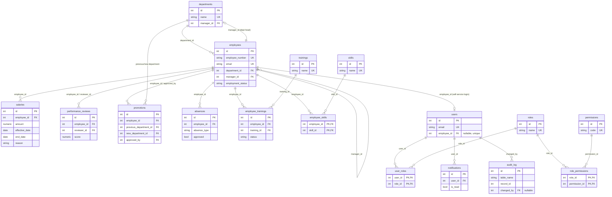
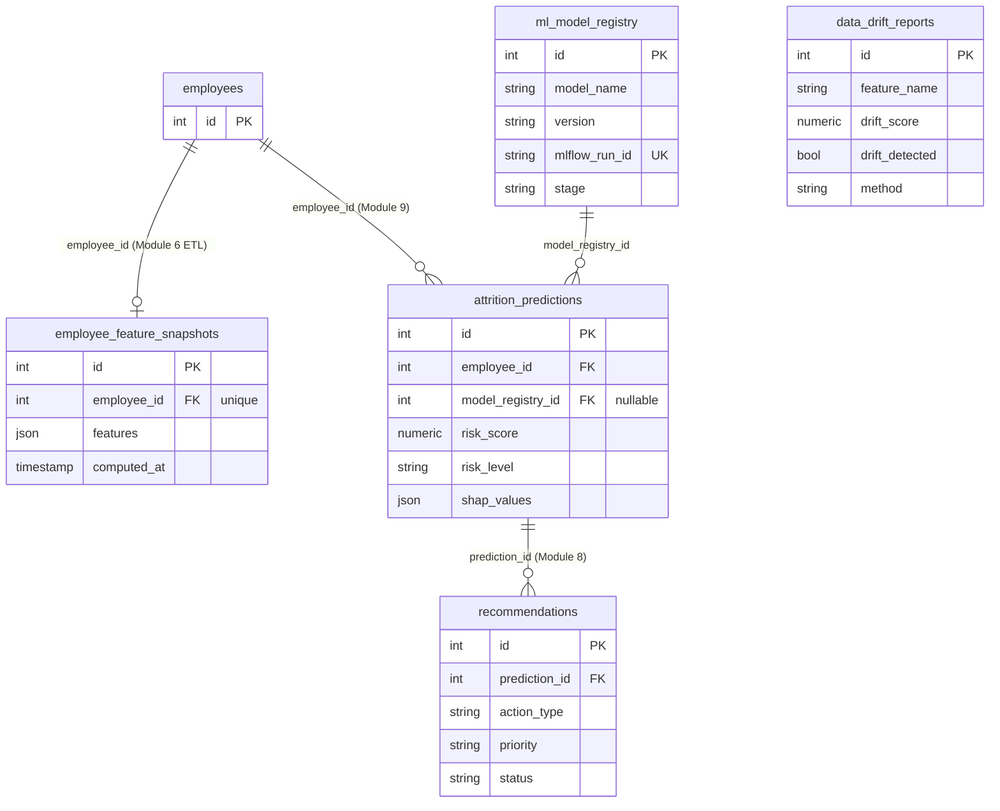

# Entity-relationship diagram

The schema is 22 tables (Module 2's initial migration, plus
`employee_feature_snapshots` added in Module 9 — see
[`backend/app/models/`](../../backend/app/models/) for the SQLAlchemy source
of truth and [`db/sql/`](../../db/sql/) for the reporting views, triggers and
stored function layered on top). Split into two diagrams below by domain;
`employees` is the join point between them.

## HR domain + auth/RBAC

`departments.manager_id` and `employees.manager_id` are a circular pair
(a department points at its head, an employee points at their manager) —
`departments.manager_id`'s FK is declared `use_alter=True` in
[`department.py`](../../backend/app/models/department.py) so Alembic can
create both tables before wiring the constraint that closes the loop.

## ML / MLOps domain

`data_drift_reports` (Module 10) has no FK into the HR schema by design —
each row is a feature-level statistic (`feature_name`, e.g. `"OverTime"`)
comparing two `employee_feature_snapshots` periods, not a fact about any
one employee.
