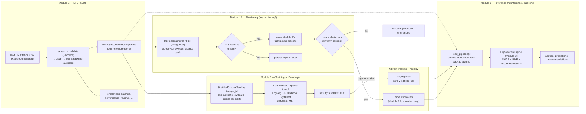

# ML pipeline: data to a served prediction

How a raw CSV becomes a risk score and a recommendation a manager can act
on, spanning Modules 6 through 10.

## Why this shape

- **`employee_feature_snapshots` exists so training and inference see the
  exact same columns the same way.** Salary/performance/absence data is
  normalized into its own domain tables for the operational API, but the
  model was trained on the *raw* IBM dataset's columns (`JobLevel`,
  `OverTime`, `EnvironmentSatisfaction`, ...) — most of which have no other
  home in that normalized schema. Re-deriving them from the operational
  tables at inference time would risk silently drifting from what the
  model actually learned; snapshotting them once at ETL time doesn't.
- **`lineage_id`-grouped splits exist because bootstrap+jitter augmentation
  creates near-duplicate rows.** A plain stratified split let a synthetic
  row and its real "parent" land on opposite sides of train/test,
  inflating ROC AUC to ~0.99 by letting models partly recognize
  near-duplicates instead of learning the real pattern (see the
  [Machine Learning](../../README.md#machine-learning) section for the
  corrected ~0.78-0.80 scores).
- **Promotion requires beating the incumbent, not just finishing training.**
  Module 7's `train.py` always registers its best run under `staging` —
  that's just "the last thing that finished training," not necessarily
  good. Only Module 10's retraining path can move the `production` alias,
  and only when the new run's ROC AUC beats whichever model — production if
  one has ever been promoted, staging otherwise — is currently ahead.
