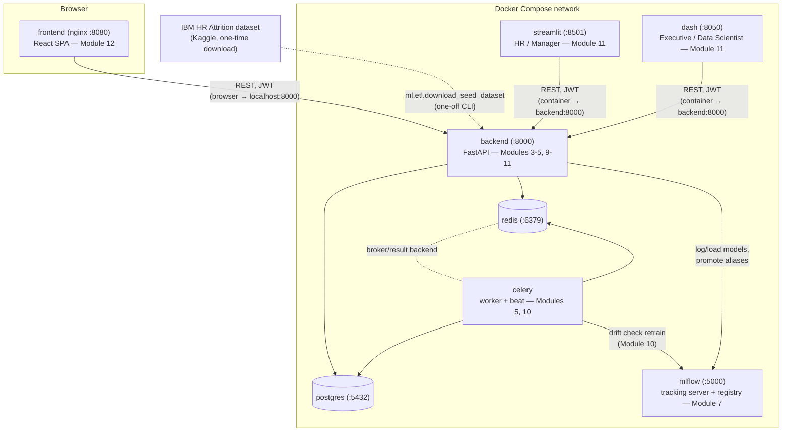

# System architecture

Every service in the [Docker Compose stack](../../docker/docker-compose.yml)
(Module 13) and how they talk to each other. Two rules hold throughout the
platform:

- **The REST API is the only way into the data.** Dashboards and the
  frontend never open a database connection of their own — they call the
  same versioned API (`/api/v1`) that everything else uses, so RBAC is
  enforced in exactly one place.
- **Browser-side clients and server-side clients resolve the backend
  differently.** The frontend's JS runs in the visitor's browser, so it
  needs a host-reachable URL (`http://localhost:8000`); the dashboards run
  their HTTP calls from Python inside their own container, so they use the
  Docker network's service name (`http://backend:8000`) instead. Mixing
  these up is the most common way to misconfigure this stack.

## Request paths

**A logged-in HR user viewing an employee's 360 profile (frontend):**
browser → `GET /api/v1/reports/employees/{id}/360` on `backend` →
`ReportsService` runs raw SQL against `v_employee_360`
([`db/sql/views.sql`](../../db/sql/views.sql), Module 2) → `postgres`.

**A data scientist triggering a prediction (frontend or dashboards):**
`POST /api/v1/employees/{id}/predictions` → `PredictionService` loads the
current model from `mlflow` (preferring the `production` alias, falling
back to `staging` — Module 9/10), reconstructs the employee's feature row
from `employee_feature_snapshots`, runs `ExplanationEngine` (SHAP + LIME +
recommendations, Module 8), and persists an `attrition_predictions` row +
its `recommendations` in one transaction.

**The nightly drift check (`celery beat`, Module 10):** compares the
oldest and newest `employee_feature_snapshots` batches, persists one
`data_drift_reports` row per feature, and — if enough features drifted —
reruns the full training pipeline and promotes the result to `mlflow`'s
`production` alias only if it beats whatever's currently serving.

## Not yet containerized

The ETL pipeline (`ml.etl.pipeline`) and a training run
(`ml.training.train`) are one-off maintenance commands run inside the
`backend` container (see the root [README](../../README.md#full-stack-docker-compose)),
not services of their own — there's nothing for them to serve once they've
finished loading data or logging a model to `mlflow`.
